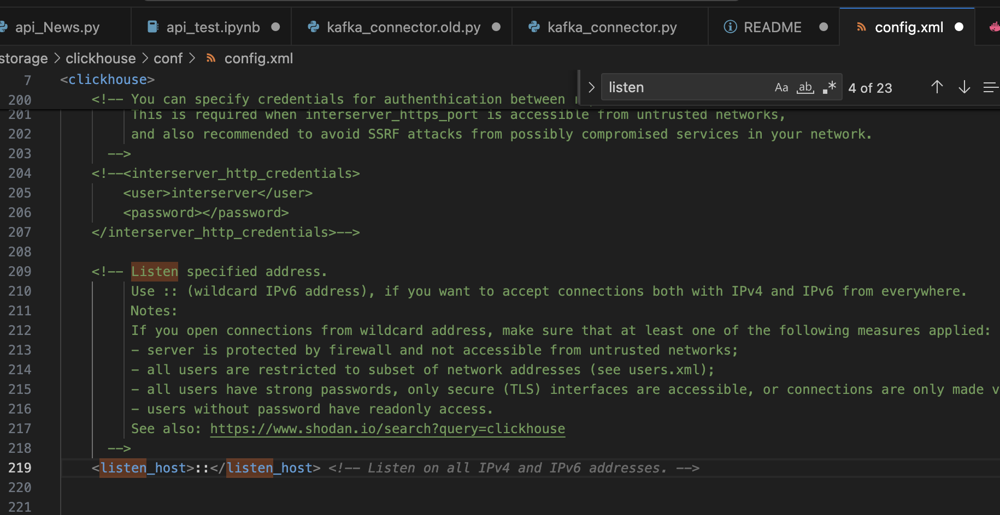
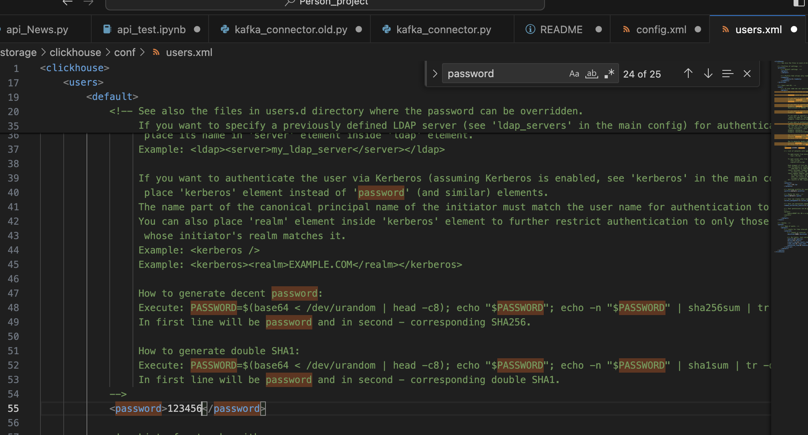
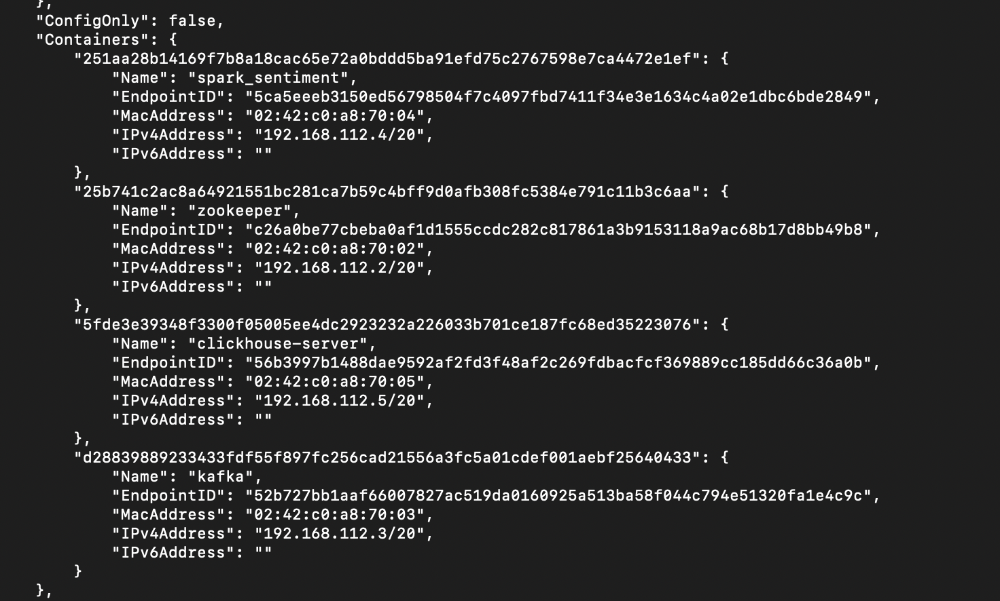
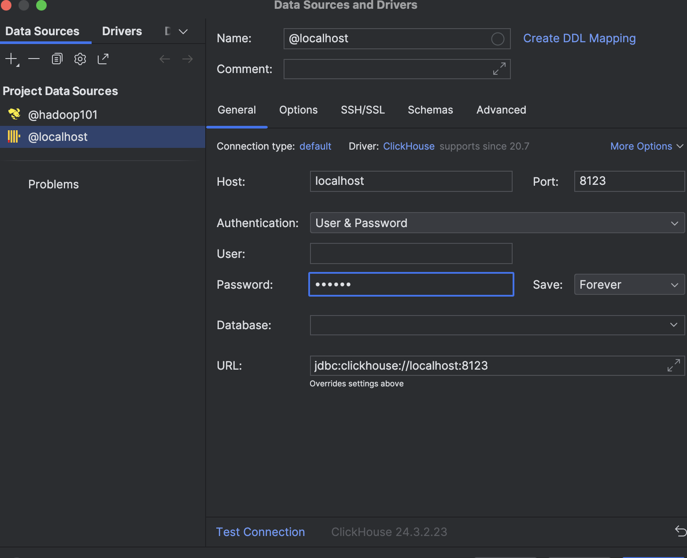
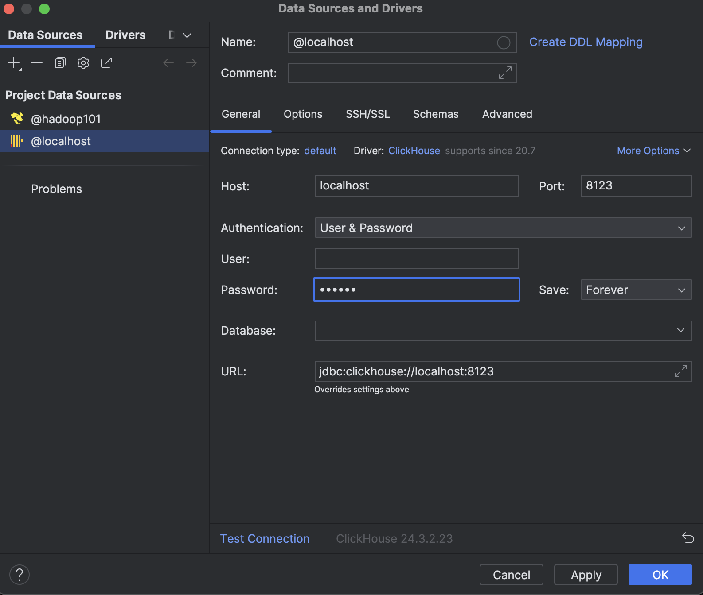
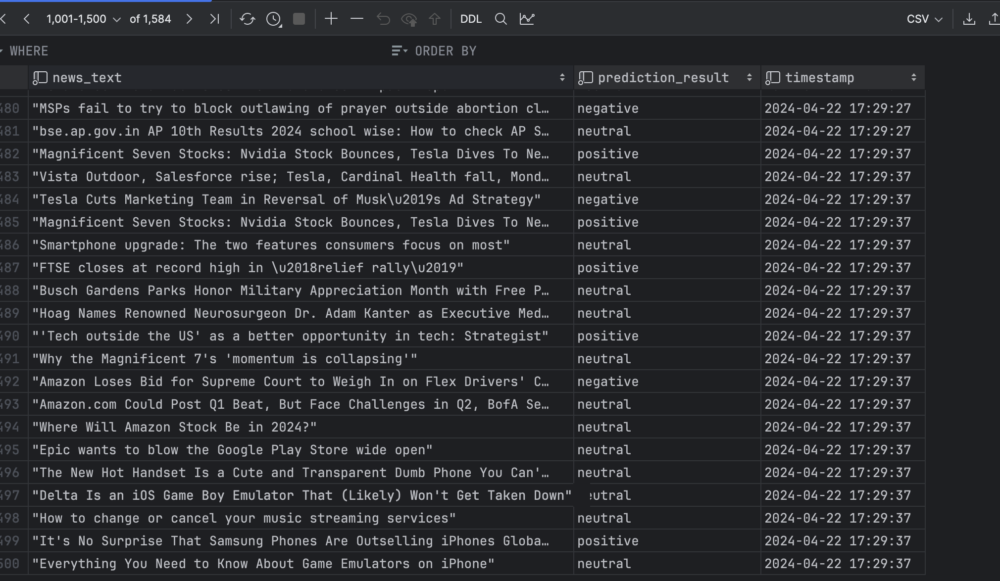

# 1.项目概述

- ## 项目背景

​	在当前金融变换莫测的时代，如何从金融新闻标题获取民生对股市，经济，企业的看法态度尤为重要。本项目为了应对当前互联网**人工智能**发展趋势以及**大数据**发展潮流，搭建了一个从0到1的基于***kakfa+sparkstreaming+NLP深度学习模型+clickhouse数据库***的***全自动微批式金融文本分析***的项目。最终实现**数秒**内可分析**千条**新闻头条情感信息, 将形如"PayPal snaps 7-day losing streak with marginal gain"输出预测**positive**。 系统最终将新闻情感分为三大类positive,neutral,negative.

注意⚠️：该项目仅用于个人学习，让初学者了解工程化技术，容器化技术，熟悉全流程的项目搭建，该项目是standalone架构，所以学习者无需担心分布式环境，学习者只需要准备一台16g内存的笔记本就好。后续将会发布分布式版本，若有小伙伴感兴趣，记得star一下哦❤️, 关注不迷路！！

# 2.技术架构

- ## 技术选型

  编译环境： **vscode** + 远程容器remote 操作python文件（vscode远程remote操控容器下的python脚本 具体百度）
  容器化技术：**docker-compose** 进行服务搭建

  消息处理：**kafka**  本项目使用它进行数据削峰，减少sparkstreaming端压力
  核心功能： **spark** + 使用来自 [hugging face](https://huggingface.co/) 中预训练模型**distiilbert** ( 已加载到本地 ) 
  数据库： **clickhouse** 列式存储，在数据科学领域条件查询，机器学习，聚类分析，聚合分析，列式存储效率远高于传统行式存储数据库

## 系统架构


1. 通过定时调度器**crontab**（linux 自带，windows可选用其他任务调度器），脚本从每日早上9点到下午5点 每隔1小时调度一次获取最新新闻数据
2. 新闻数据通过docker 端口映射到 **kafka**指定主题**finance-news**上( kakfa_producer )，zookeeper用于管理kafka，由于单机模式 用处不是很大 主要管理元数据。
3. spark容器, 本项目中容器叫**spark-sentiment**，作为spark-streaming核心，以kafka—consumer 的身份消费kafka broke 数据
4. spark-streaming 消费到的数据发送给**clickhouse-server**容器中的clickhouse数据库，
5. 宿主机通过外部数据库连接工具，可以实时查看clickhouse 数据库内容，进行**OLAP**分析（这一步可视化展示没有实现，敢兴趣的小伙伴可以玩一下）

以上是系统架构全流程的简单介绍，下面我们正式开始项目搭建以及项目模块的详细教程。 Allez !! c'est parti !!!!


# 3.安装和环境配置(standalone)

（说明： 本项目教程默认使用 PERSON_PROJECT/ 路径下搭建，小伙伴可以按自己的想法创建目录）

（具体环境文件已经放在目录中）若丢失请按照下面步骤按照

## python 环境安装（conda包管理）

```
conda env create -f environment.yml
conda activate nlp
```

请使用文件目录下的enviroment.yml 进行环境统一配置

##### 预备条件： 若没有安装，请先去官网安装[docker客户端](https://www.docker.com)

## Mac arm架构（m芯片）

对于mac小伙伴，老师已经给你们准备好了docker 镜像环境，


### clickhouse,spark, kafka 以及 zookeeper，使用docker-compose 安装

在项目目录下创建docker-compose.yml, 编辑该文件，内容如下

```yml
version: "3.0"
networks:
  myNetwork:

services:	
  clickhouse:
    image: 'chen0177/clickhouse:latest'
    container_name: clickhouse-server
    restart: no
    ports:
    	- '8123':'8123'
    volumes:
    	- ./storage/clickhouse/conf/config.xml:/etc/clickhouse-server/config.xml
    	- ./storage/clickhouse/conf/users.xml:/etc/clickhouse-server/users.xml
    	- ./storage/clickhouse/data:/var/lib/clickhouse/
    networks:
      - myNetwork
	spark:
		image: 'chen0177/pyspark:latest'
    container_name: spark_sentiment
    restart: no
    ports:
      - '8888:8888'
      - '4040:4040'
    networks:
      - myNetwork
      
  zookeeper:
    image: 'chen0177/zookeeper:latest'
    container_name: zookeeper
    restart: no
    ports:
      - '2181:2181'
    environment:
      - ALLOW_ANONYMOUS_LOGIN=yes
    volumes:
      - zookeeper_data:/bitnami/zookeeper 
    networks:
      - myNetwork
      
  kafka:
    image: 'chen0177/kafka:latest'
    container_name: kafka
    user: root
    restart: no
    ports:
      - '9092:9092'
      - '9093:9092'
    environment:
      - KAFKA_BROKER_ID=1
      - KAFKA_INTER_BROKER_LISTENER_NAME=INTERNAL
      # 9093 给内网使用 spark容器连接 走这条路， 9092给外部python脚本使用
      - KAFKA_LISTENERS=INTERNAL://:9093,EXTERNAL://:9092
      # spark 容器根据容器通信连接9092， 宿主机根据端口映射原理连接9092
      - KAFKA_ADVERTISED_LISTENERS=INTERNAL://kafka:9092,EXTERNAL://localhost:9092
      # 使用不同的监听器名称来区分不同的安全和网络配置
      - KAFKA_LISTENER_SECURITY_PROTOCOL_MAP=INTERNAL:PLAINTEXT,EXTERNAL:PLAINTEXT
      - KAFKA_ZOOKEEPER_CONNECT=zookeeper:2181
      - ALLOW_PLAINTEXT_LISTENER=yes

    volumes:
      - ./Kafka:/bitnami/kafka
    networks:
      - myNetwork
    depends_on:
      - zookeeper
      

```

​	最后保存文件，假设在该（在person_project/）目录下，执行 `docker-compose up -d`，即可完成搭建. 命令行终端输入`docker ps -a`现在的docker 容器应该向如下所示


**（注意若以上环境docker-compose 存在问题), 请分开使用docker 单独加载镜像。直接去官网拉取最新的镜像安装即可**

## windows 环境 

### clickhouse 安装说明

对于windows 的小伙伴，同样可以使用docker-compose 安装但是唯一要注意的的是clickhouse的安装，由于mac 版本老师已经在镜像中做了配置文件的更改，windows并没有更改配置 因此需要进行下面配置，首先单独安装clickhouse 容器，操作如下：

```shell
############ clickhouse docker install
docker run --rm -d --name=temp-clickhouse-server clickhouse/clickhouse-server:latest

# in local machine, create these three directories, after we need to use it as volume
# attention: you should choose the right path that you preferred  in your local machine
mkdir -p ./storage/clickhouse/conf ./storage/clickhouse/data ./storage/clickhouse/log

docker cp temp-clickhouse-server:/etc/clickhouse-server/users.xml ./storage/clickhouse/conf/users.xml
docker cp temp-clickhouse-server:/etc/clickhouse-server/config.xml ./storage/clickhouse/conf/config.xml

docker stop temp-clickhouse-server

```

接着在**本地** 目录打开刚才我们挂载的卷轴 ./storage/clickhouse/conf/users.xml，修改文件如下


图解： 更改成你需要监听**(文件查找listen)**的端口号，当前我们在学习阶段，单机模式，写成任意即可，生产环境一定要修改哦！


打开 user.xml,修改如下


图解：给clickhouse 设置初始密码**(文件查找password)**

接着在当前项目根目录下，终端执行下面命令

```shell
docker run -d --name=clickhouse-server \
-p 8123:8123 \
--network=person_project_myNetwork \
--volume=./storage/clickhouse/conf/config.xml:/etc/clickhouse-server/config.xml \
--volume=./storage/clickhouse/conf/users.xml:/etc/clickhouse-server/users.xml \
--volume=./storage/clickhouse/data:/var/lib/clickhouse/ \
clickhouse/clickhouse-server:latest
```

这样clickhouse 容器就安装好啦。

### spark，kafka，zookeeper 安装

同理还是使用docker-compose 构建，在项目根目录下新建文件docker-compose.xml，唯一需要注意的是更换image源

```yml
version: "3.0"
networks:
  myNetwork:

services:	
	spark:
		image: 'jupyter/pyspark-notebook'
    container_name: spark_sentiment
    restart: no
    ports:
      - '8888:8888'
      - '4040:4040'
    networks:
      - myNetwork
      
  zookeeper:
    image: 'bitnami/zookeeper:latest'
    container_name: zookeeper
    restart: no
    ports:
      - '2181:2181'
    environment:
      - ALLOW_ANONYMOUS_LOGIN=yes
    volumes:
      - zookeeper_data:/bitnami/zookeeper 
    networks:
      - myNetwork
      
  kafka:
    image: 'bitnami//kafka:latest'
    container_name: kafka
    user: root
    restart: no
    ports:
      - '9092:9092'
      - '9093:9092'
    environment:
      - KAFKA_BROKER_ID=1
      - KAFKA_INTER_BROKER_LISTENER_NAME=INTERNAL
      # 9093 给内网使用 spark容器连接 走这条路， 9092给外部python脚本使用
      - KAFKA_LISTENERS=INTERNAL://:9093,EXTERNAL://:9092
      # spark 容器根据容器通信连接9092， 宿主机根据端口映射原理连接9092
      - KAFKA_ADVERTISED_LISTENERS=INTERNAL://kafka:9092,EXTERNAL://localhost:9092
      # 使用不同的监听器名称来区分不同的安全和网络配置
      - KAFKA_LISTENER_SECURITY_PROTOCOL_MAP=INTERNAL:PLAINTEXT,EXTERNAL:PLAINTEXT
      - KAFKA_ZOOKEEPER_CONNECT=zookeeper:2181
      - ALLOW_PLAINTEXT_LISTENER=yes

    volumes:
      - ./Kafka:/bitnami/kafka
    networks:
      - myNetwork
    depends_on:
      - zookeeper
      

```


### 容器通信测试

使用命令`docker network ls` 将会显示你的docker 容器网络信息 


使用`docker network inspect person_project_myNetwork`, 应该会出现下面的信息


你会发现他们在同一个局域网下，现在你可以开始进入一个容器，比如`docker exec -it spark_sentiment bash`, 通过ping 容器名称的形式，查看容器间通信是否正常. 查看是否丢包
使用 `nc -vz 容器名称:端口号` ，查看容器间端口号访问是否正常. 如何成功监听将会返回**succeed** 

到这里我们已经完成了全部容器通信的部署，如果还存在问题请**查看文档常见问题**部分。

加油你离成功不远了。👏👏👏👏👏👏


# 4.搭建预处理

## 4.1 kafka topic搭建

运行kafka 容器，`docker exec -it kafka bash`, 进入容器以后执行下面命令 创建kafka topic，由于本项目是单机的，不考虑分布式的情况，因此比较简单，那么后续分布式项目也将会发出.敬请期待

```shell
# 创建名为 finance-news 的主题，并设置保留策略为一天
kafka-topics.sh --create --bootstrap-server localhost:9092 --replication-factor 1 --partitions 1 --topic finance-news --config retention.ms=86400000

# 查看当前主题的配置： 使用 kafka-configs.sh 工具查看当前主题的配置，以了解当前的保留策略和其他配置。
# kafka-configs.sh --bootstrap-server localhost:9092  --entity-type topics --describe --entity-name finance-news

# 修改保留策略： 使用 kafka-configs.sh 工具来修改主题的保留策略。您可以使用 --alter 参数来指定要修改的配置。
# kafka-configs.sh --bootstrap-server localhost:9092 --entity-type topics --alter --entity-name finance-news --add-config retention.ms=86400000

```

成功创建好后可以打开两个docker kafka容器终端 使用producer，consumer 在本地测试是否可以生存和消费成功
`kafka-console-producer.py --bootstrap-server localhost:9092 --topic finance-news`
`kafka-console-consumer.py --bootstrap-server localhost:9092 --topic finance-news`

## 4.2 clickhouse建表

运行clickhouse容器，由于我们的项目仅供学习，因此我们使用默认的数据库default，请小伙伴们使用navicat，或者datagrip 客户端进行数据库连接，连接比如如下所示




注意第一次运行的小伙伴：可能需要下载驱动文件，等待几分钟下载完即可，输入本地密码 之前配置文件配过的，连接
如果到这里成功了，那么恭喜你，我们项目搭建基本快完成了，只差最后一步，建表

```sql
## DDL TABLE 
## consider our data is not big, so we divide the data by month
CREATE TABLE news_analysis (
    news_text String,
    prediction_result String,
    timestamp DateTime
) ENGINE = MergeTree()
PARTITION BY toYYYYMM(timestamp)
ORDER BY timestamp;
```

解释： 在这里我们选用按每日分区，因为一天大概会载入16批数据，每批数据根据api请求的个数成百上千不等，一天下来可能有万条数据，所以按天分区是个好手段。 
介绍一下第一个字段，第一个字段用于存储新闻文本，第二个字段用于预测新闻文本，第三个字段用于存储当日载入时间， 具体需求可以根据你们以后自己的项目来扩展，这是一个很好的开始。


## 4.3 spark容器下脚本文件创建

在spark-sentiment 容器 家目录下新建kf_to_sstreaming的脚本文件


正如上图所示，systeme是我们自己操作系统下的脚本文件，然而sparkstreaming服务在容器spark-sentiment中，因此我们想要使用spark环境只能在spark容器中进行，我们需要在spark容器 新建kf_to_sstreaming.py 为后续程序运行做铺垫。

到这里我们的前期准备快要加速了，如果你能学到这里，那你真的很不错，加油⛽️⛽️

# 5.搭建主要功能和模块


## 5.1 api 新闻微批式抓取

在项目根目录创建一个api_news.py 文件, 该文件主要用于存储api函数，该函数主要返回json结构，在后续中我们只要新闻的头条文本
如下（部分）：

```python
from newsapi import NewsApiClient
import requests
def fetch_financial_news_seekingalpha():
    
    url = "https://seeking-alpha.p.rapidapi.com/news/v2/list"

    querystring = {"category":"market-news::financials","size":"40"}
    
    headers = {
        "X-RapidAPI-Key": "e3ffde7ad0msh33323e10f821f13p15885bjsn25fc84293c2a",
        "X-RapidAPI-Host": "seeking-alpha.p.rapidapi.com"
    }

    response = requests.get(url, headers=headers, params=querystring)

    return response.json()
```


## 5.2 推送到kafka topic流函数

在项目根目录下创建名为kafka_connector.py 文件，对于每个api函数我们都发送给kafka处理，如下（部分），完整代码请看github文件

```python
from kafka import KafkaProducer
import json
import re
import api_News

# Clean data rules
pattern = re.compile(r'^[a-zA-Z0-9\s.,!?\'"()-]*$')

# kafka's configuration
kafka_server = 'localhost:9093'
topic_name = 'finance-news'

# create Kafka producer，message code as UTF-8
producer = KafkaProducer(bootstrap_servers=kafka_server,
                         value_serializer=lambda m: json.dumps(m).encode('utf-8'))

# send news to kafka fonction
def send_news_to_kafka(headline):
    try:
        future = producer.send(topic_name, value=headline)
        result = future.get(timeout=10)
        print(f"Sent and acknowledged: {headline} at offset {result.offset}")
    except Exception as e:
        print(f"Failed to send headline to Kafka: {headline}, Error: {e}")
    

# excute the fetch and send news
news_apis = [
    (api_News.fetch_bbc_news, "BBC"),
    (api_News.fetch_financial_news_seekingalpha, "SeekingAlpha"),
    (api_News.fetch_financial_news_newsdataio, "NewsdataIO"),
    (api_News.fetch_Yahoo_financial_news_famous_brand, "Yahoo"),
    (api_News.fetch_financial_news_apple, "Apple"),
    (api_News.fetch_financial_news_tsla2, "Tesla"),
    (api_News.fetch_news_everything, "Everything")
]

def fetch_and_send_news(api_method, api_name):
    try:
        sources_news = api_method()
        if api_name=="Yahoo":
            for source in sources_news:
                for i in source.keys():
                # try to send the news to kafka, ifnot exception
                    send_news_to_kafka(source[i]['title'])

-。。。。。。。。。。。。。。。。。。。。。。
。。。。。。。。。。。。。。。。。。

```


## 5.3 sparkstreaming + NLP微调预训练模型

在docker spark_sentiment 容器中家目录下新建python文件，名字叫kf_to_sstreaming.py 目录

将huggingface 模型（见附录链接）下载到容器中使用，先下载到宿主机，然后使用
`docker cp [模型名称]  spark_sentiment:/home/joyvan/`  推送到容器的家目录下和脚本文件同目录

```python
。。。。。。。
# 加载本地模型和分词器
model_path = './distilbert-base-uncased_System_analyse_sentiment'
model = AutoModelForSequenceClassification.from_pretrained(model_path)
tokenizer = AutoTokenizer.from_pretrained(model_path)
# 使用pipeline简化预测过程
classifier = pipeline('text-classification', model=model, tokenizer=tokenizer)
## mac m1/m2/m3 使用 mps , windows 使用 cuda
device = torch.device("mps" if torch.backends.mps.is_available() else "cuda")
model.eval()  # Set model to evaluation mode

def predict_sentiment(headlines):
    # Prepare input
    inputs = tokenizer(headlines, return_tensors="pt", truncation=True, max_length=512)
    with torch.no_grad():
        outputs = model(**inputs)
    logits = outputs.logits
    probabilities = torch.softmax(logits, dim=-1)
    predicted_class_index = probabilities.argmax(dim=-1).item()
    
    # Mapping class index to label
    sentiment_labels = {0: "negative", 1: "neutral", 2: "positive"}
    return sentiment_labels[predicted_class_index]
 。。。。。。。。。。。。
```

在这里最终实现的功能是，传入一行数据，输出一个情感分类


## 5.4 sparkstreaming 读取kafka源

配置kafka 服务器地址和topic ，代码如下（部分，接着上面的脚本文件），具体查看github

```python
# 初始化 Spark 会话
spark = SparkSession.builder \
    .appName("KafkaSparkStreaming") \
    .config("spark.streaming.backpressure.enabled", "true") \
    .config("spark.streaming.batchDuration", "10") \
    .getOrCreate()

# 本地资源不够，关闭检查点
spark.conf.set("spark.sql.streaming.forceDeleteTempCheckpointLocation", "true")
spark.sparkContext.setLogLevel("WARN")
# 设置 Kafka 服务器和主题
kafka_topic_name = "finance-news"
kafka_bootstrap_servers = 'kafka:9093'

# 这里使用timeout参数，避免因为网络问题导致的超时问题， 以及在使用时出现 warn警告 kafka-1894, 不要担心，pyspark与kafka兼容性问题
# 如果不喜欢warn，修改log4j.properties文件，将log4j.logger.org.apache.kafka.clients.NetworkClient=ERROR，自行google搜索
df = spark \
  .readStream \
  .format("kafka") \
  .option("kafka.bootstrap.servers", kafka_bootstrap_servers) \
  .option("subscribe", kafka_topic_name) \
  .option("startingOffsets", "latest") \
  .load()
```


## 5.5 sparkstreaming 写入clickhouse数据库

还是接着上门脚本文件，全文件我放在了github上

```python
## ================== 数据处理 ================================================
## 列名需要与 clickhouse 数据库表字段名一致
# 转换 key 和 value 从二进制到字符串
df_transformed = df.select(
    #col("key").cast("string").alias("key"),  目前不需要 key，可自行添加
    col("value").cast("string").alias("news_text")
)
# 注册 UDF
predict_sentiment_udf = udf(predict_sentiment, StringType())
# 应用 NLP 模型进行分析
df_transformed = df_transformed.withColumn("prediction_result", predict_sentiment_udf(col("news_text")))  # 传入 value 列
# 加入当天日期
df_transformed = df_transformed.withColumn("timestamp",date_format(current_timestamp(),"yyyy-MM-dd HH:mm:ss"))

# 定义 ClickHouse 的连接参数
url = "jdbc:clickhouse://clickhouse-server:8123/default"
properties = {
    "user": "default",   # 默认用户名
    "password": "123456",      # 默认没有密码，如果设置了密码需要更改
    "driver": "com.clickhouse.jdbc.ClickHouseDriver"
}


# 配置写入 ClickHouse 的数据流,但是 clickhouse 不支持dataframe的流式写入，所以我们使用foreachBatch 微批次流写入
# epoch_id 是每个批次的唯一标识符 必须写入，否则会报错
def write_to_clickhouse(batch_df, epoch_id):
  try:
    """
    写入每个批次的数据到 ClickHouse。
    """
    batch_df.write \
        .format("jdbc") \
        .option("url", url) \
        .option("dbtable", "news_analysis") \
        .option("user", properties["user"]) \
        .option("password", properties["password"]) \
        .option("driver", properties["driver"]) \
        .option("checkpointLocation", "./checkpoint/analysis") \
        .mode("append") \
        .save()
    print(f"Batch {epoch_id} successfully written to ClickHouse.")
  except Exception as e:
    print(f"Error writing batch {epoch_id} to ClickHouse: {str(e)}")


query = df_transformed.writeStream \
    .outputMode("append") \
    .foreachBatch(write_to_clickhouse) \
    .start()

query.awaitTermination()

```

## 5.6 宿主机查询clickhouse数据库数据

当我们启动docker容器 clickhouse-server 时，默认数据库服务已经启动，可以在宿主机上使用navicat或者datagrip等客户端工具进行查询，这里我以datagrip客户端为例，如下图所示

直接找到对应的数据库，输入初始化密码，在最初配置文件中是123456，输入连接即可，最终数据库会显示如下所示（以下结果仅用于展示，项目启动请看下面一章内容）

至此项目，全模块已经搭建完成，下一章我将带领大家如何启动我们的项目。

# 6.用户手册

## **github 项目文件介绍**

- **kf_to_sstreaming.py：请把该文件放入spark-sentiment容器的家目录下**

- api_test.ipynb: 早期测试api使用，无意义

- **api_News.py: api新闻调用模块，封装各个新闻api函数**

- docker-compose.xml: 早期docker-compose配置文件，**大家根据教程上的文件进行更新，不要使用我的配置文件！**

- start_server.sh 项目启动脚本，仅仅启动容器

- stop_server.sh 项目关闭脚本，（这个和之前这个有bug未优化，小伙伴可以自己设计脚本 不难）

- **kafka_connector.py: 采集新闻文本到kafka broke 中**

- storage： clickhouse 容器挂载文件目录

  （本项目核心文件为加粗字体）

## 调度工具

linux/Mac 系统 使用crontab 对 kafka_connector.py 进行半小时调度
输入命令 crontab -e 此时在打开的文件中输入以下命令

```
0 9-17 * * * /Users/chenchenjunjie/anaconda3/envs/nlp/bin/python ./Person_project/kafka_connector.py >> ./Person_project/logfile.log 2>&1

```

此时该脚本可以正常根据系统时间被调用, 日志文件会输出程序运行结果

windows系统，可自行在网上搜索任务调度工具即可

另外，本项目自动化任务不是很多，若搭建繁杂任务多的自动化项目，可以使用airflow，dolphin schedule等优秀调度任务工具。

## 项目程序执行顺序以及运行代码

1. 依次开启docker 容器， zookeeper， clickhouse-server， kafka，spark-sentiment

2. 在spark-sentiment容器中，载入**kf_to_sstreaming.py**脚本, 在容器终端运行

   ```shell
   ## 在提交时可能还会出现会http5client 的警告，导入maven包就好
   spark-submit \
   --packages org.apache.spark:spark-sql-kafka-0-10_2.12:3.5.0,com.clickhouse:clickhouse-jdbc:0.6.0,org.apache.httpcomponents.client5:httpclient5:5.3.1 \
   kf_to_sstreaming.py 
   ```

​     

3. 在本地宿主机项目目录下 终端运行 `python3  kafka_connector.py`，或者如果配置crontab ，它将会自动执行。


运行完该脚本文件，等待步骤2终端是否变化， 


发现spark 已经成功消费，并且将流传给了clickhouse。

4. 在clickhouse客户端查询，打开datagrip我们发现



通过时间我们发现最新一批数据已经进入clickhouse，项目整体流程结束。 

**程序运行教学视频演示将在后续迭代版本中放入**

# 7.常见错误


## 警告1 \## 在提交spark submit 时出现http5client 的警告，导入maven包就好

```shell
spark-submit \
--packages org.apache.spark:spark-sql-kafka-0-10_2.12:3.5.0,com.clickhouse:clickhouse-jdbc:0.6.0,org.apache.httpcomponents.client5:httpclient5:5.3.1 \
kf_to_sstreaming.py 
```

## 警告2 \## clickhouse 提交出现警告

参考 https://github.com/ClickHouse/metabase-clickhouse-driver/blob/master/CHANGELOG.md 是官方实锤 系统bug，不要紧


## 警告3 在启动sparkstreaming后，接受来自kafka的消息，出现KAFKA-1894

WARN KafkaDataConsumer: KafkaDataConsumer is not running in UninterruptibleThread. It may hang when KafkaDataConsumer's methods are interrupted because of KAFKA-1894

注意：出现这种情况 不要管它，不影响使用，sparkstreming跟kafka api部分不兼容 没关系
\# 如果不喜欢warn，修改log4j.properties文件，将log4j.logger.org.apache.kafka.clients.NetworkClient=ERROR

## 错误1 关于启动kafka时的问题，关于broker_id 或者 node 问题

解决：注意一定要先启动zookeeper，并且等一段时间，再启动kafka容器
若是不行 请删除zookeeper volume中 data目录下的 version-2 文件，重启容器， 若还是不会可询问chatgpt，各大网站。

## 错误2 关于容器通信问题

有些小伙伴，容器没有使用docker-compose安装，如果采用独立安装，请让每个容器处于同一个网络下

使用： `docker network connect 容器名 网络名` 即可 无需重启容器

## 数据采集异常

解决：请去各大api网站查看是否api 已更新，或者json结构已发生变化，需要各位小伙伴自行测试，可以打开一个ipynb文件 进行数据保存 测试，**注意不要在脚本文件上测试，因为各大api 请求次数有限，谨慎操作**

## 其他错误

**如果还是存在错误，请在github discussion 上留言，看到后我会第一时间解答。**


# 8.结语

🍾🍾🍾祝贺！！！ 你已经成功完成了这个基于spark自动NLP情感分析的项目，现在你熟悉了从0到1如何搭建起大数据框架加深度学习的流程，在日后学习中，可以按照这个思路进行项目构思，非常感谢你的阅读🙏. 
我们后续分布式项目再见👋（创作不易😊，如果这个项目对于你们有不少的灵感，希望可以贡献一下你们的⭐️⭐️⭐️.）

鸣谢 @网友 spider 对项目改进的意见.

# 9.附录

- hugging_face 模型下载链接：*https://huggingface.co/CHEN6688/DistillBert_for_sparkStreaming/tree/main*
- Transformer classification 教程来源巴黎萨克雷大学研究员marcevrard：*https://github.com/marcevrard/nlp-with-transformers-book*
- 本项目finetuning模型来自 hugging face ： *https://huggingface.co/CHEN6688/DistillBert_for_sparkStreaming/tree/main*
- Distillbert模型横向对比基线模型准确率 来自实验：*https://github.com/Michel-debug/NLP_Sentiment_analyse*各大新闻api 来源rapideapi ：*https://rapidapi.com/hub*
- 其他api ： *https://newsapi.org*
- sparkstreaming参考文档:*https://spark.apache.org/streaming/*
- Kafka producer api 参考文档：*https://kafka.apache.org/documentation/#producerapi*

# 法律声明

***Copyright © 2024 Junjie CHEN. All rights reserved. Unauthorized copying of this file, via any medium is strictly prohibited***

***Copyright © 2024 https://github.com/Michel-debug. All rights reserved. Unauthorized copying of this file, via any medium is strictly prohibited***


